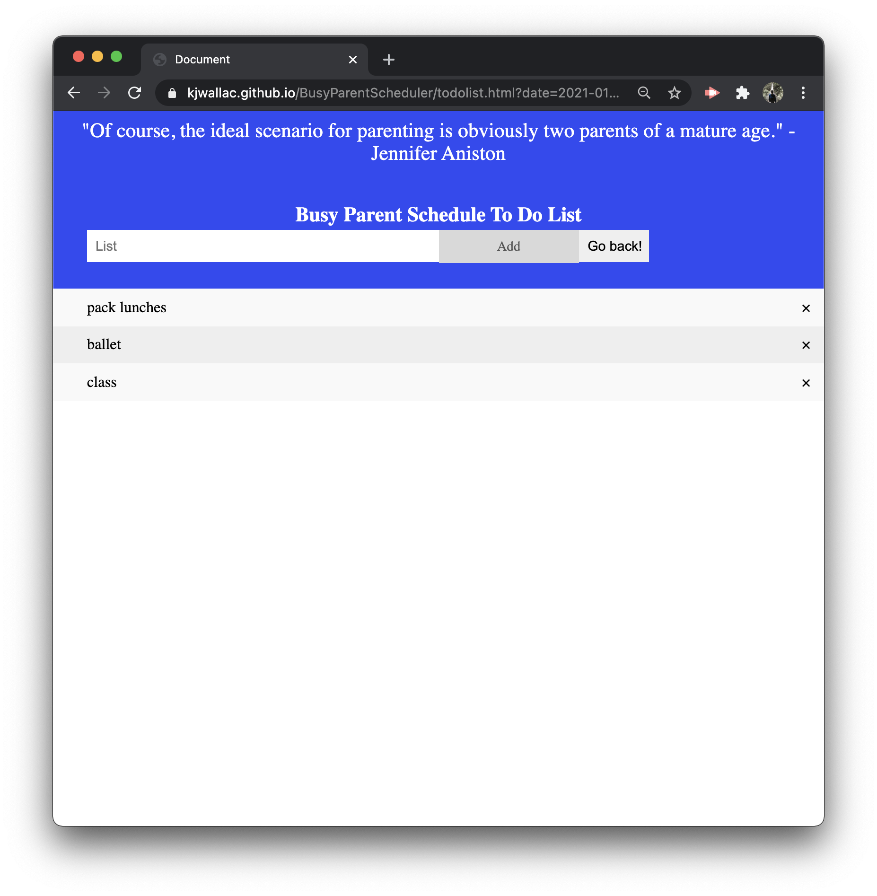

# Busy Parent Scheduler
Project 1 - Busy Parent Scheduler App
[Busy Parent Scheduler deployed site](https://kjwallac.github.io/BusyParentScheduler/calendar.html)
[BusyParentScheduler Repo](https://github.com/kjwallac/BusyParentScheduler)

## Project Screen Shots

## User Story / Use Cases
We built this app for the intention of parents who have a busy life style that they could schedule their work week, personal life, and childrens schedule all in one place. For families that like to plan in advance the app allows you to select days weeks away and still be able to put in a "to do" item. The user will also have updated weather depending on the location they are at when they open the calendar.

## User Instructions
Basic instructions for this app:
    1. open the calendar
    2. select a day you would like to add a to do to
    3. once on the to do screen type inside the text bar the event you will need to remember
    4. click add
    5. finally click the back button to return to the calendar

## Dev Process
Clint: The languages I used for this project were HTML, CSS, and Javascript. I worked on the Calendar page mostly using HTML and CSS. The javascript I used was to work on the weather API to load the users current weather and location. I used geolocation (longitude/latitude) to do this. For the HTML i mostly worked on the header tag. The wireframe I ended up using for the app was "zurb foundation". I used zurb with the days of the week by creating a list. CSS was a different beast because I needed to figure out a way to style the JQuery calls. 
### Calendar page
Clint & Kristina
Clint: working on the calendar page we used some html, a lot of javascript, and an even crazier amount of CSS. The many troubles that I kept running into was setting the @ medias to coincide when I would shrink the screen. For the weather to be displayed we used the [openweather](https://openweathermap.org/) API. Using Geolocation to determine the users longitude / latitude the user will have access to the weather of the city they are in.

Kristina: Once the HTML skeleton was in place, I was able to manipulate the calendar days buttons through the DOM. Using moment, the days are all given a YYYY-MM-DD formatted unique dateKey. This dateKey is passed in to the todoList URL upon button click and allows the todoList to render only the tasks for the given dateKey. The quote API proved difficult to figure out until I used Postman. Postman helped especially in formatting the authorization string.

### Calendar page
Clint: working on the calendar page we used some html, a lot of javascript, and an even crazier amount of CSS. The many troubles that I kept running into was setting the @ medias to coincide when I would shrink the screen. 

Kristina: the calendar days are fully rendered through manipulating the DOM, and navigating through the months shows the days always in the correct weekday columns.

### Todo List page
Ron & Eric

Kristina: the quote API used is favqs. The displayed quote is randomized from a list of quotes with the "parenting" tag, keeping in theme with the app.

 ## Future Development
Future updates for the app would be to give the user alerts for when a particular item on their to do list is coming up. As well as giving an alert to the user when they are past due that to do and that it wasnt marked off as completed. I would also like to update the screen for when the user is on their phones that they can either stay on the month screen or the screen can be selected to show day by day.